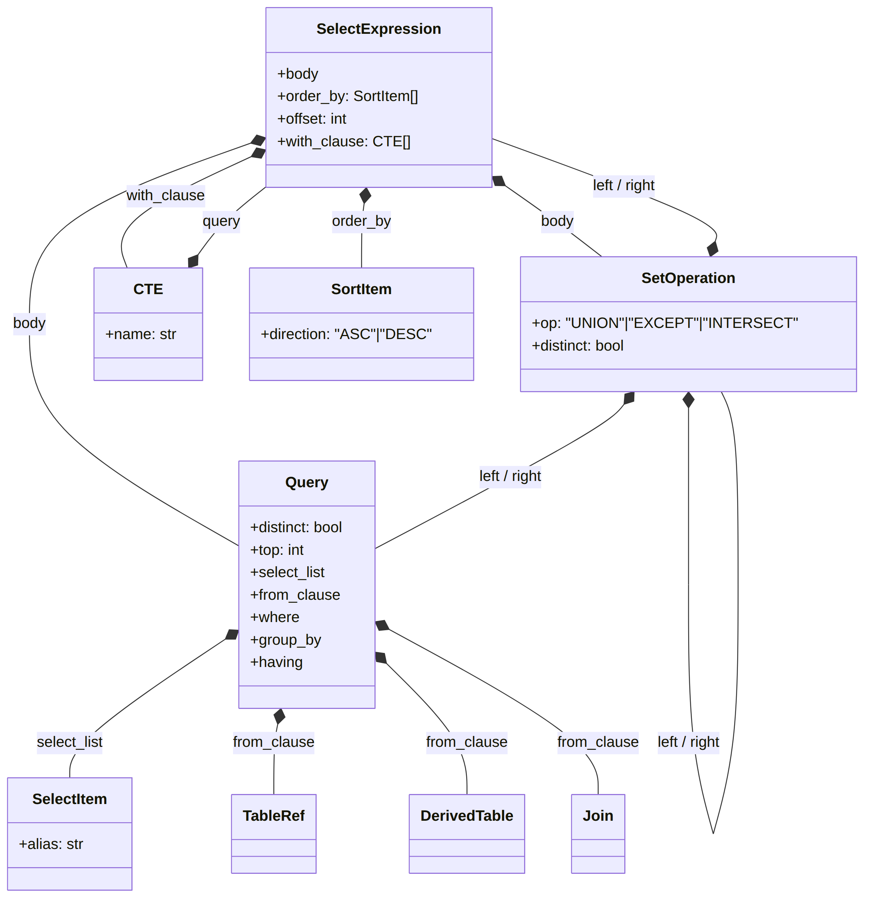
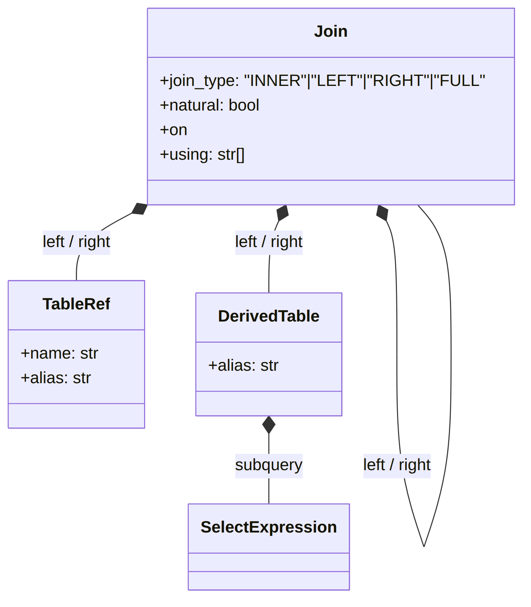
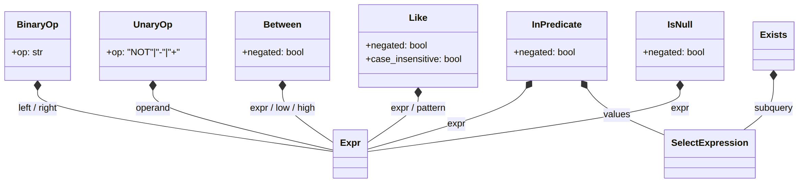
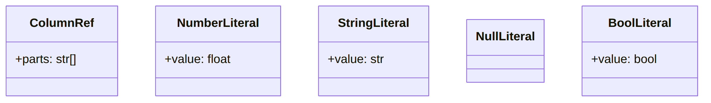
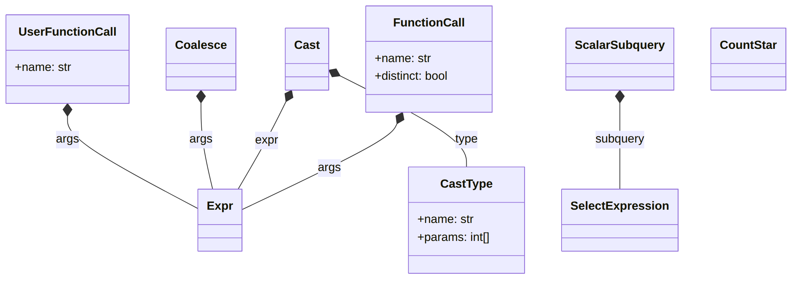
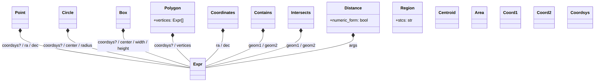

# The pyadql AST: a guided tour

This document explains **what the AST means**, not just what fields each
class has (that part is in the docstrings inside `ast_nodes.py`, one per
class). Read this once before working with the AST for the first time;
use the reference table below as a lookup afterwards.

## 1. The big picture: how to read the shape

`parse_adql(query)` always returns a `SelectExpression`. It is a thin
wrapper, not the query itself:

```
SelectExpression
├── body          -- the actual result-producing part: a Query, or a SetOperation
├── order_by      -- applies to the WHOLE combined result (ADQL 2.1)
├── offset        -- ditto
└── with_clause   -- WITH ... AS (...) common table expressions (ADQL 2.1)
```

This is not an arbitrary design choice: it mirrors a real ADQL 2.1 change.
`ORDER BY` / `OFFSET` apply once, to the combined result of any
`UNION`/`EXCEPT`/`INTERSECT`, never to an individual unparenthesized
`SELECT`. So for the extremely common case of "just one plain SELECT, no
set operations", you'll write `tree.body.where`, `tree.body.select_list`,
etc. for the query's own clauses, and `tree.order_by`, `tree.offset` for
the two clauses that sit one level up.

`tree.body` is one of:
- **`Query`** -- an ordinary `SELECT ... FROM ... WHERE ... GROUP BY ... HAVING ...`
- **`SetOperation`** -- the result of `UNION`/`EXCEPT`/`INTERSECT`, whose
  own `left`/`right` are each *again* a `Query`, a `SetOperation` (chained
  set ops), or a `SelectExpression` (when that operand was parenthesized
  and therefore has its own `ORDER BY`/`OFFSET`)

Below the `Query`/`SetOperation` level, everything is built from one
recurring idea: an **`Expr`** (a big `Union` of ~30 classes -- `BinaryOp`,
`ColumnRef`, `FunctionCall`, the geometry nodes, etc.) that represents "any
ADQL value expression". Predicates, function arguments, `SELECT` items,
`WHERE`/`HAVING` conditions -- all of them are built out of `Expr`.

## 2. Simplified diagrams, grouped by category

These diagrams are deliberately incomplete (only the fields that matter for
orientation, not every one) -- they show *shape*, not a full spec. `Expr`
in these diagrams is not a real class; it stands in for "any of the ~30
value-expression node types", to avoid a diagram with 30 boxes.

### Query structure



### Table sources (FROM)



### Predicates (WHERE / HAVING / ON)



### Values and literals



### Functions and CAST



### Geometry (the ADQL-specific part)



`Circle.center` / `Box.center` / one item of `Polygon.vertices` is either a
`Coordinates` pair (a raw `ra, dec`) or any other point-valued `Expr` (a
column, `POINT(...)`, `CENTROID(...)`, a UDF) -- an ADQL 2.1 addition.
Check `isinstance(center, Coordinates)` to tell the two forms apart.

## 3. Worked example

```sql
SELECT TOP 100 g.source_id, g.ra, g.dec,
       DISTANCE(POINT('ICRS', g.ra, g.dec), POINT('ICRS', 56.75, 24.12)) AS dist
FROM gaiadr3.gaia_source AS g
WHERE CONTAINS(POINT('ICRS', g.ra, g.dec), CIRCLE('ICRS', 56.75, 24.12, 0.5)) = 1
ORDER BY dist ASC
```

`parse_adql(query)` returns (comments added, not part of the real repr):

```python
SelectExpression(
    body=Query(
        distinct=False,
        top=100,                                    # TOP 100
        select_list=[
            SelectItem(expr=ColumnRef(['g', 'source_id'])),
            SelectItem(expr=ColumnRef(['g', 'ra'])),
            SelectItem(expr=ColumnRef(['g', 'dec'])),
            SelectItem(
                expr=Distance(                       # DISTANCE(...) AS dist
                    args=[
                        Point(coordsys=StringLiteral('ICRS'),
                              ra=ColumnRef(['g', 'ra']), dec=ColumnRef(['g', 'dec'])),
                        Point(coordsys=StringLiteral('ICRS'),
                              ra=NumberLiteral(56.75), dec=NumberLiteral(24.12)),
                    ],
                    numeric_form=False,               # the two-Point overload, not the 4-number one
                ),
                alias='dist',
            ),
        ],
        from_clause=[
            TableRef(name='gaiadr3.gaia_source', alias='g'),
        ],
        where=BinaryOp(                              # "... = 1" wraps CONTAINS(...)
            op='=',
            left=Contains(
                geom1=Point(coordsys=StringLiteral('ICRS'),
                            ra=ColumnRef(['g', 'ra']), dec=ColumnRef(['g', 'dec'])),
                geom2=Circle(coordsys=StringLiteral('ICRS'),
                             center=Coordinates(ra=NumberLiteral(56.75), dec=NumberLiteral(24.12)),
                             radius=NumberLiteral(0.5)),
            ),
            right=NumberLiteral(1.0),
        ),
        group_by=None,
        having=None,
    ),
    order_by=[SortItem(expr=ColumnRef(['dist']), direction='ASC')],  # lives on SelectExpression, not Query
    offset=None,
    with_clause=None,
)
```

A few things worth noticing here, because they trip people up the first time:

- `dist` in `ORDER BY dist` is just a `ColumnRef(['dist'])` -- pyadql does
  not resolve it back to the `Distance(...)` expression it's aliased from;
  that kind of alias resolution is up to your own code if you need it.
- `CONTAINS(...) = 1` is an ordinary `BinaryOp('=', ...)` wrapping a
  `Contains` node -- there is no special "contains predicate" node; ADQL
  itself defines `CONTAINS`/`INTERSECTS` as numeric functions (returning
  0/1), compared like any other number.
- `ORDER BY` sits on the outer `SelectExpression`, not inside `Query` --
  see section 1.

## 4. Node reference table

| Node | ADQL construct | Key fields | Notes |
|---|---|---|---|
| `SelectExpression` | the whole query (root) | `body`, `order_by`, `offset`, `with_clause` | returned by `parse_adql()`; also wraps every subquery |
| `CTE` | one `WITH name AS (...)` entry | `name`, `query` | ADQL 2.1 |
| `Query` | one `SELECT ... FROM ...` | `distinct`, `top`, `select_list`, `from_clause`, `where`, `group_by`, `having` | no `order_by`/`offset` here |
| `SetOperation` | `UNION`/`EXCEPT`/`INTERSECT` | `op`, `distinct`, `left`, `right` | |
| `Star` | `SELECT *` | -- | |
| `SelectItem` | one SELECT-list entry | `expr`, `alias` | |
| `SortItem` | one ORDER BY entry | `expr`, `direction` | |
| `TableRef` | a plain table in FROM | `name`, `alias`, `columns` | |
| `DerivedTable` | `(SELECT ...) AS alias` in FROM | `subquery`, `alias` | |
| `Join` | one JOIN | `left`, `right`, `join_type`, `natural`, `on`, `using` | left-leaning tree for chained joins |
| `BinaryOp` | AND/OR/arithmetic/concat/comparisons | `op`, `left`, `right` | one class, many operators |
| `UnaryOp` | `NOT x` / unary `-x`/`+x` | `op`, `operand` | |
| `Between` | `BETWEEN` | `expr`, `low`, `high`, `negated` | |
| `InPredicate` | `IN (...)` | `expr`, `values`, `negated` | `values` is a list *or* a `SelectExpression` |
| `Like` | `LIKE`/`ILIKE` | `expr`, `pattern`, `negated`, `case_insensitive` | |
| `IsNull` | `IS [NOT] NULL` | `expr`, `negated` | |
| `Exists` | `EXISTS (...)` | `subquery` | |
| `Contains` | `CONTAINS(...)` | `geom1`, `geom2` | numeric predicate, usually wrapped in `= 1` |
| `Intersects` | `INTERSECTS(...)` | `geom1`, `geom2` | ditto |
| `ColumnRef` | a column, e.g. `t.ra` | `parts` | |
| `NumberLiteral` / `StringLiteral` / `NullLiteral` / `BoolLiteral` | literals | `value` | |
| `FunctionCall` | a recognized ADQL function call | `name`, `args`, `distinct` | aggregates, numeric/trig, LOWER/UPPER |
| `CountStar` | `COUNT(*)` | -- | |
| `Cast` / `CastType` | `CAST(x AS type)` | `expr`, `type` / `name`, `params` | ADQL 2.1 |
| `Coalesce` | `COALESCE(...)` | `args` | ADQL 2.1 |
| `UserFunctionCall` | any unrecognized `name(...)` | `name`, `args` | TAP-service UDFs |
| `ScalarSubquery` | `(SELECT ...)` used as a value | `subquery` | |
| `Point` / `Circle` / `Box` / `Polygon` | geometry constructors | `coordsys`, ... | `coordsys` optional (ADQL 2.1) |
| `Coordinates` | a raw `ra, dec` pair | `ra`, `dec` | one form of a center/vertex |
| `Region` | `REGION('stc-s')` | `stcs` | plain `str`, not an `Expr` |
| `Centroid` / `Area` / `Coord1` / `Coord2` / `Coordsys` | geometry accessors | `geom` | |
| `Distance` | `DISTANCE(...)` | `args`, `numeric_form` | two overloads, see docstring |

## 5. Walking the tree

There's no built-in visitor class (the AST is intentionally just plain
dataclasses, no behavior), but a generic walker is a few lines since every
node is a dataclass:

```python
from dataclasses import fields, is_dataclass
from pyadql import parse_adql
from pyadql import ast_nodes as A

def walk(node, callback):
    """Call `callback(node)` for every AST node reachable from `node`."""
    if is_dataclass(node) and isinstance(node, A.Node):
        callback(node)
        for f in fields(node):
            walk(getattr(node, f.name), callback)
    elif isinstance(node, list):
        for item in node:
            walk(item, callback)

# Example: collect every column referenced anywhere in the query.
tree = parse_adql("SELECT ra FROM t WHERE dec > 0 AND CONTAINS(POINT('ICRS', ra, dec), c.footprint) = 1")
columns = []
walk(tree, lambda n: columns.append(str(n)) if isinstance(n, A.ColumnRef) else None)
print(columns)  # ['ra', 'dec', 'ra', 'dec', 'c.footprint']
```

Swap the `isinstance` check in the callback for whatever you're looking for
(`A.FunctionCall` to find function calls, `A.TableRef` to find referenced
tables, etc.) -- this is the same pattern used internally by
`examples/basic_usage.py` and by `pyadql.cli.node_to_dict` (which instead
serializes every node to a dict with a `"_type"` tag, for the `--json` CLI
output).
